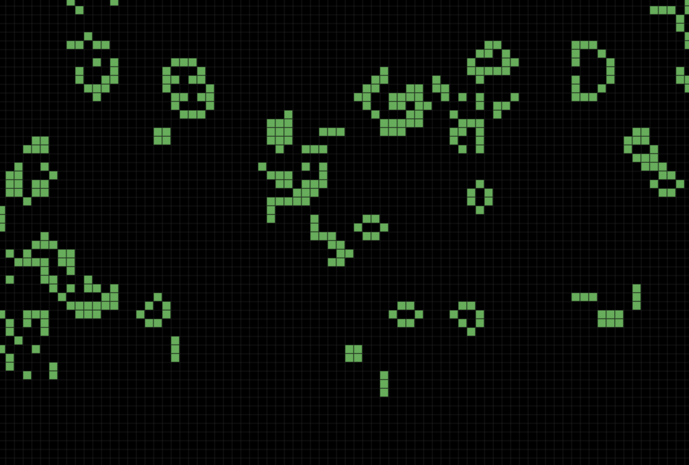

# Infinite Game of Life

An interactive implementation of Conway's Game of Life with infinite grid, zoom, and pan capabilities built with HTML5 Canvas.

## Features

- 🎮 Infinite grid system
- 🖱️ Interactive cell placement with mouse clicks
- 🔄 Play/Pause simulation with spacebar
- 🎲 Generate random patterns with 'G' key
- 🔍 Zoom in/out with mouse wheel
- 🌐 Pan across the grid by dragging
- ⚡ Smooth performance with optimized cell updates
- 📱 Responsive design that adapts to window size

## Controls

| Action | Control |
|--------|---------|
| Toggle cells | Left Click |
| Pan grid | Click and Drag |
| Zoom | Mouse Wheel |
| Play/Pause | Spacebar |
| Random Pattern | G key |

## Technical Details

- Pure JavaScript implementation
- Uses HTML5 Canvas for rendering
- Efficient cell storage using Map data structure
- Implements classic Conway's Game of Life rules:
  - Any live cell with 2 or 3 live neighbors survives
  - Any dead cell with exactly 3 live neighbors becomes alive
  - All other cells die or stay dead

## Visual Features

- Dark theme interface
- Green cells on black background
- Subtle grid lines for better visualization
- Smooth zoom and pan animations

## Getting Started

1. Clone this repository
2. Open `jeudelavie.html` in your web browser
3. Start creating life patterns!

No additional dependencies or installation required.

---

*Note: This is an educational project demonstrating cellular automata concepts and HTML5 Canvas manipulation.*
